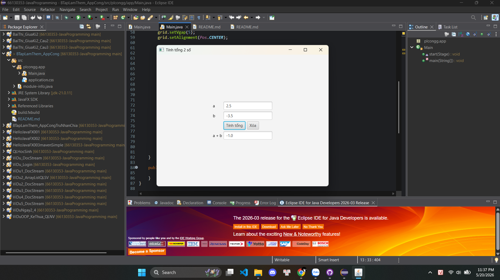

# JavaFX Sum Calculator

Ứng dụng JavaFX dùng để tính tổng của 2 số.

## Chức năng

- Nhập số thứ nhất
- Nhập số thứ hai
- Nhấn nút **Tính tổng**
- Hiển thị kết quả
- Nút **Xóa** để làm trống dữ liệu

## Công nghệ sử dụng

- Java
- JavaFX
- Eclipse IDE

## Cách chạy chương trình

1. Mở project bằng Eclipse
2. Chạy file `Main.java`
3. Nhập 2 số vào ô dữ liệu
4. Nhấn nút **Tính tổng**

## Cấu trúc giao diện

- `GridPane`: bố cục chính
- `HBox`: chứa các nút
- `TextField`: nhập dữ liệu
- `Button`: xử lý sự kiện

## Demo chạy thử

## Tác giả

PLCongg