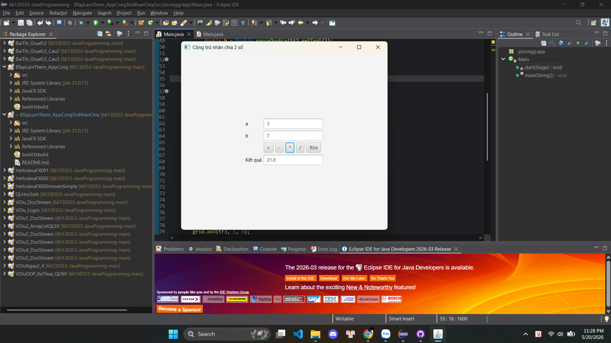

# JavaFX Calculator App

Ứng dụng JavaFX thực hiện các phép tính cơ bản:

- Cộng
- Trừ
- Nhân
- Chia

## Công nghệ sử dụng

- Java
- JavaFX
- Eclipse IDE

## Giao diện

Ứng dụng gồm:

- 2 ô nhập số
- Các nút phép toán
- Nút xóa dữ liệu
- Ô hiển thị kết quả

## Cách chạy chương trình

1. Mở project bằng Eclipse
2. Chạy file `Main.java`
3. Nhập 2 số
4. Chọn phép tính

## Cấu trúc chính

- `TextField`: nhập dữ liệu
- `Button`: thực hiện phép tính
- `GridPane`: bố cục giao diện
- `HBox`: chứa các nút theo hàng ngang

## Demo chạy thử

Test phép chia:

Test phép nhân:

## Tác giả

- PLCongg